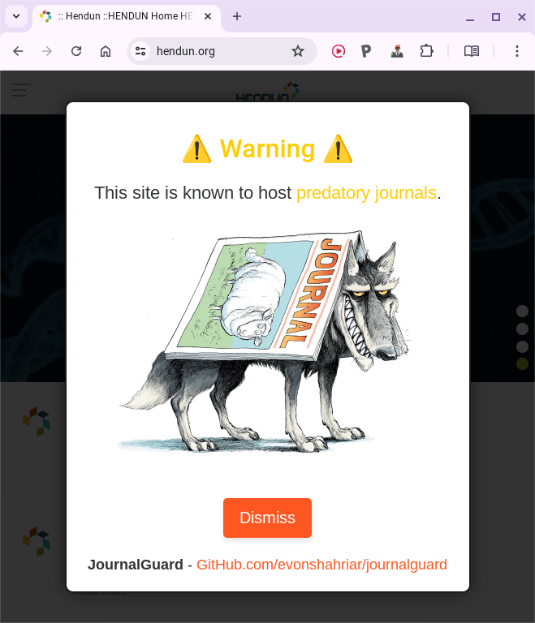

<div align="center">

# JournalGuard: A Chrome Extension for Protecting Researchers from Predatory Journals

**Evon Shahriar**


[](https://github.com/evonshahriar/JournalGuard/issues)
[](https://github.com/evonshahriar/JournalGuard/stargazers)


</div>

---

## Overview

JournalGuard is a must-have Chrome extension designed to protect researchers from falling prey to predatory journals. With a database of over 5,000 known predatory journals, JournalGuard alerts you in real-time if you navigate to one of these sites, helping you stay focused on credible research sources. Plus, the extension is regularly updated to include new predatory journals, ensuring you always have the latest protection.

<div style="display: flex; justify-content: space-around; align-items: center;">
    
    
</div>

---

## Table of Contents

1. [Introduction](#introduction)
2. [Features](#features)
3. [Installation](#installation)
4. [Usage](#usage)
5. [File Structure](#file-structure)
6. [Updating the Predatory Journal List](#updating-the-predatory-journal-list)
7. [Contributing](#contributing)
8. [License](#license)
9. [Acknowledgments](#acknowledgments)
10. [Contact](#contact)

---

## Introduction

Navigating the academic publishing landscape can be tricky, especially with the rise of predatory journals. These journals often exploit researchers by charging high fees without providing legitimate editorial and publishing services. JournalGuard acts as a vigilant companion, alerting you whenever you encounter such a journal, thus preserving the integrity of your research.

## Features

JournalGuard offers:

- **Real-time Alerts:** Receive instant warnings when you visit a known predatory journal website.
- **Easy Reporting:** Report suspicious journals directly from the extension, helping to keep the database up-to-date.
- **User-friendly Design:** Clear and visually appealing alerts to ensure you don’t miss any warnings.
- **Community-Driven:** The database of predatory journals is updated regularly based on user reports and new findings.

## Installation

Follow these simple steps to install JournalGuard:

1. Clone or download the source code:
   ```bash
   git clone https://github.com/evonshahriar/JournalGuard.git
   ```
2. Open Chrome and go to `chrome://extensions`.
3. Enable "Developer mode" in the top right corner.
4. Click "Load unpacked" and select the directory where you saved the JournalGuard files.

## Usage

After installation, JournalGuard runs automatically in the background:

- You’ll see a warning overlay if you visit a known predatory journal site.
- Click the JournalGuard icon in your browser toolbar to access the popup interface.
- Use the popup to report new predatory journals or to flag the current site.

## File Structure

Here’s an overview of the key files in JournalGuard:

| File | Description |
|------|-------------|
| `manifest.json` | Defines the extension's properties and permissions |
| `background.js` | Manages background processes, including URL checks |
| `content.js` | Injects the warning overlay into web pages |
| `popup.html` | The structure of the popup interface |
| `popup.js` | Implements the functionality of the popup interface |
| `predatory_sites.csv` | Contains the list of known predatory journal websites |

## Updating the Predatory Journal List

The core of JournalGuard’s protection is the `predatory_sites.csv` file. Here’s how to keep it updated:

1. Open `predatory_sites.csv` in a text editor or spreadsheet application.
2. Each entry should be in the format: `URL,Publisher,Source`.
3. Add or update entries as necessary.
4. Save the file and reload the extension for changes to take effect.

> **Note:** Regular updates ensure the extension remains effective.

## Contributing

Want to help make JournalGuard even better? Here’s how you can contribute:

1. Fork the repository.
2. Create a new branch for your feature:
   ```bash
   git checkout -b feature/AmazingFeature
   ```
3. Commit your changes:
   ```bash
   git commit -m 'Add some AmazingFeature'
   ```
4. Push to the branch:
   ```bash
   git push origin feature/AmazingFeature
   ```
5. Open a Pull Request.

## License

JournalGuard is licensed under the MIT License. See the [LICENSE](LICENSE) file for more details.

## Acknowledgments

- Icon by [Freepik](https://www.freepik.com) from [Flaticon](https://www.flaticon.com).
- Data sourced from various academic resources and community contributions.


---

<div align="center">

*Made with ❤️ for the academic community*

</div>
